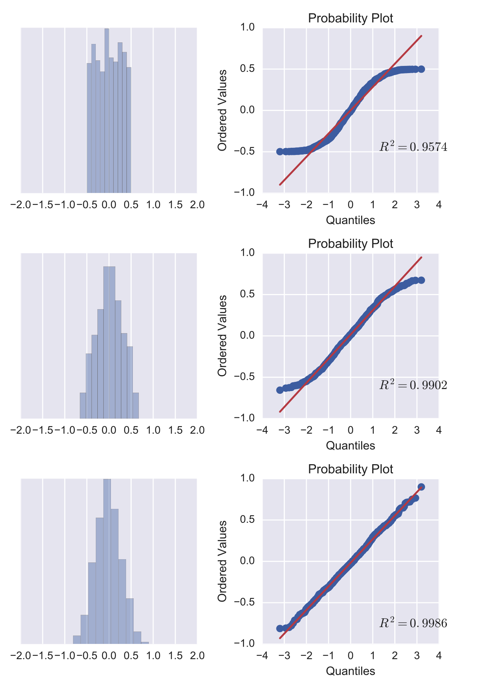
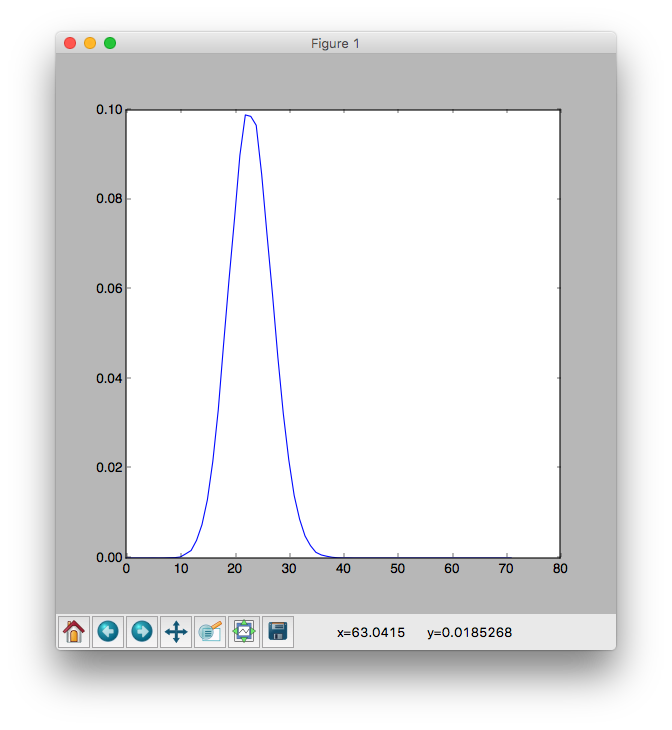

# normalization-simulation
# 시뮬레이션을 통한 중심극한정리의 성립 확인

2017 1학기 확률과 통계 수행평가 - 중심극한정리에 대한 탐구

### 개요
 고등학교 수학과목 중 확률과 통계에 등장하는 통계 문제를 풀다보면, 확률변수 X가 이항분포 B(n, p)를 따를 때, n이 충분히 크면 확률변수 X는 근사적으로 정규분포 N(np, npq)를 따른다는 중심극한정리를 이용하는 경우가 많다. 


* 수능특강 확률과 통계 90p
~~~
확률변수 X가 이항분포 B(n,p)를 따를 때 n이 충분히 크면 확률변수 X는 근사적으로 정규분포 N(np, npq)를 따른다.
(단 q = 1-p)
~~~

수학 문제를 풀 때에는 교과서에 정리된 내용에 따라 이항분포 B(n, p)는 당연히 정규분포 N(np, npq)를 따른다고 생각하고 문제를 풀게 되는데, 과연 실제로 모든 이항분포 B(n, p)가 n이 충분히 클 때 정규분포 N(np, npq)를 따르게 되는지에 대해 의문을 가지게 되었으며 n이 충분히 크다는 것이 모호하다고 생각하였다.
 따라서 파이썬을 통해 직접 시뮬레이션을 구현하여 궁금한 점을 해결해보고자 한다. 또한, 문제집에 등장하는 실제 문제를 시뮬레이션하여 이항분포가 등장하는 문제가 있을 때, 그 이항분포가 정규분포가 따른다는 가정하에 문제를 푸는 것이 맞는지 검정하고자 한다.

### 선행지식

#### Quantile (분위수)
- 분위수란 모집단, 표본의 전체 도수를 n 등분한 것이다.

#### QQPlot

 본 탐구에서 중심극한정리가 성립하는 것을 확인하기 위해서는 임의의 이항분포가 n이 충분히 클 때 정규분포를 따르는지 확인할 수 있는 척도가 필요하다.
어떠한 확률변수가 특정 분포를 따르는지를 시각적으로 검정할 수 있는 방법이 바로 QQ플롯이며, 여러 분포중 정규분포에 대한 검정을 진행할 수 있는 QQPlot을 normal-QQPlot이라 한다.

그렇다면, QQ플롯은 어떻게 정규분포의 검정을 진행하는가?

우선, 검정할 데이터가 n개의 자료라고 하자. 만약 n개의 자료가 표준정규분포 N(0,1)을 따른다면, 데이터를 크기순으로 정렬했을 떄 자료는 다음의 n개 구간에 하나씩 포함되게 된다.

~~~
(0, 1/n), (1/n, 2/n), (n-1/n, 1)
~~~

따라서 자료가 표준정규분포를 따른다면 i번째 자료는 i번째 구간의 중간값 (i-1/2/n)을 가질 것으로 기대할 수 있다.
이를 이용하여 QQ 플롯은 자료값의 분위수를 y로, 검정하고자 하는 분포의 기댓값을 x로 하는 점을 그래프에 그려 산포도로 나타낸다.

 따라서 검정하고자 하는 자료가 정규분포를 따른다면 y=x 직선상에 놓이게 된다.

##### 사피로-월크 검정

QQPlot이외에도, 사피로-월크(Shapiro-Wilk)검정은 검정하고자 하는 자료가 정규분포로부터 나왔는지 검정할 수 있는 검정 방법이다.

본 탐구에서 이용할 Python Scipy에서는 QQPlot을 그리기 위한 probplot 명령을 제공한다.

~~~
import scipy as sp
sp.stats.probplot(x, plot=plt)
~~~

#### 본론

 본 탐구에서는 2017 확률과 통계 수능특강에서 등장하는 예제를 이용할 것이다.

 ~~~
  문제) 주사위 한 개를 72회 던질 때 3의 배수인 눈의 수가 16회 이상, 32회 이하가 나올 확률을 구해보자
  (단, Z가 표준 정규 분포를 따르는 확률변수일 때 P(0<=Z<=2) = 0.4772이다.)

  풀이)
  3의 배수의 눈의 수가 나오는 횟수를 확률변수 X라 하면 X는 이항분포 B(72, 1/3)을 따르므로 구하는 확률
  P(16<=X<=32) = P(X=16) + ... + P(X=32)
  이나, 이 값을 구하기는 쉽지 않다.

   이 같은 경우에는 이항분포와 정규분포의 관게를 이용하여 다음과 같이 확률을 구할 수 있다.

   E(X) = 72 * 1/3 =24, V(X) = 72 * 1/3 * 2/3 = 16 = 4^2
  이고, 72는 충분히 큰 수이므로 확률변수 X는 근사적으로 정규분포 N(24, 4^2)을 따른다.
  따라서 Z = (X - 24) / 4로 놓으면 확률 변수 X는 표준정규분포 N(0,1)을 따르므로

 ... 이하 생략
 ~~~

 위 문제에서의 의문점은 '72는 충분히 큰 수이므로 확률변수 X는 근사적으로 정규분포 N(24, 4^2)을 따른다' 가 과연 성립하는지에 대한 것이다.

 그래서 위에서 제시한 QQPlot을 이용하여 과연 이항 분포 B(72, 1/3)은 정규분포를 따르는지 파악하도록 할 것이다.

우선 주사위 한개를 던지는 사건을 만들어 보도록 하겠다. 다행이도, 파이썬 numpy 패키지에서는 이러한 작업을 쉽게 할 수 있도록 함수를 제공한다

~~~
import numpy as np
n, p = 10, .5
s = np.random.binomial(n, p, 1000)

> 4 6 6 5 6 7 4 6 7 7 3 7 7 3 4 6 4 4 5 4 6 4 4 6 6 4 5 5 7 4 7 4 5 2 6 6 2
 6 4 4 6 6 5 1 4 5 7 7 5 4 3 5 5 5 7 7 7 7 7 4 3 6 7 7 4 4 4 4 4 4 6 6 5 3
 5 6 5 3 6 4 3 5 5 4 5 4 4 6 5 3 6 3 6 4 4 5 6 ...
~~~

위 코드에서는 이항분포 B(n, p)에서 n을 10, p를 1/2로 설정하였다. 따라서 위 코드가 반환하는 결과는 동전을 던지는 시행을 10번 반복하여 앞면이 나오는 개수를 세는 작업을 1000번 반복한 것이다.

위 코드를 응용하여 주사위 한 개를 72회 던질 때 3의 배수인 면이 나오는 횟수를 세어 보는 코드를 작성할 것이다.

~~~
import numpy as np
n, p = 72, 1/3
ITERATE = 1000000번
datas = np. random.binomial(n, p, ITERATE)
~~~

 주사위는 1부터 6까지 총 6개의 값을 가지고 있고 1~6에서의 3의 배수는 3과 6이므로 주사위를 던질때 3의 배수가 나올 수 있는 확률은 1/3이다. 따라서 B(n, p)에서 n을 72로, p를 1/3로 설정하였다.
위 코드를 통해 주사위를 72번 던지고 3의 배수인 면이 나오는 작업을 1000000번 반복한 결과를 가지게 되었다.

그 데이터는 아래와 같다.

~~~
[23 22 31 ..., 25 20 25]
~~~
 이제 이 데이터를 가공하여 P(X=1), P(X=2), ... P(X=71), P(X=72) 확률변수들의 값을 구할 것이다.
X는 1부터 72까지 이므로, 길이가 72인 벡터를 만든다.

~~~
v = []
for i in range(1, 73):
    v.append(0)

print(v)

> [0, 0, 0, 0, 0, 0, 0, 0, 0, 0, 0, 0, 0, 0, 0, 0, 0, 0, 0, 0, 0, 0, 0, 0, 0, 0, 0, 0, 0, 0, 0, 0, 0, 0, 0, 0, 0, 0, 0, 0, 0, 0, 0, 0, 0, 0, 0, 0, 0, 0, 0, 0, 0, 0, 0, 0, 0, 0, 0, 0, 0, 0, 0, 0, 0, 0, 0, 0, 0, 0, 0, 0]
~~~
 초기 값이 0인 길이가 72인 벡터를 만들었다. 이제 위에서 얻은 데이터를 통해 각각의 확률 변수 값을 구해보도록 하겠다.

 ~~~
for data in datas:
    v[data-1] = v[data-1] + 1

print(v)

> [0, 0, 0, 0, 0, 1, 0, 1, 5, 8, 22, 92, 167, 393, 742, 1298, 2154, 3295, 4785, 6225, 7566, 8996, 9890, 9858, 9659, 8573, 7210, 5889, 4470, 3217, 2196, 1395, 866, 492, 277, 127, 68, 39, 16, 5, 1, 2, 0, 0, 0, 0, 0, 0, 0, 0, 0, 0, 0, 0, 0, 0, 0, 0, 0, 0, 0, 0, 0, 0, 0, 0, 0, 0, 0, 0, 0, 0]

 ~~~

 위 코드를 시행하면 [0,0, ... 22, 92, ... 0] 과 같은 결과가 나온다. v 벡터에 들어있는 n번째 데이터는 주사위를 던졌을 때 3의 배수인 눈이 n번째 나온 횟수를 의미한다.
데이터 v를 활용하여 확률변수를 구해보도록 하겠다.

~~~
for i in range(1, 72):
    print('i : ', i)
    v[i] /= ITERATE

print(v)

> [0, 0.0, 0.0, 0.0, 0.0, 1e-05, 0.0, 1e-05, 5e-05, 8e-05, 0.00022, 0.00092, 0.00167, 0.00393, 0.00742, 0.01298, 0.02154, 0.03295, 0.04785, 0.06225, 0.07566, 0.08996, 0.0989, 0.09858, 0.09659, 0.08573, 0.0721, 0.05889, 0.0447, 0.03217, 0.02196, 0.01395, 0.00866, 0.00492, 0.00277, 0.00127, 0.00068, 0.00039, 0.00016, 5e-05, 1e-05, 2e-05, 0.0, 0.0, 0.0, 0.0, 0.0, 0.0, 0.0, 0.0, 0.0, 0.0, 0.0, 0.0, 0.0, 0.0, 0.0, 0.0, 0.0, 0.0, 0.0, 0.0, 0.0, 0.0, 0.0, 0.0, 0.0, 0.0, 0.0, 0.0, 0.0, 0.0]

~~~

 위 코드는 v 벡터의 각 원소들을 반복한 횟수, 즉 위에서의 ITERATE 값으로 나누어 3의 배수인 눈이 나온 확률을 구하게 된다.
또한, 확률 값이 저장되어 있는 v 벡터의 각 원소들을 더하면, 1과 같거나 거의 1에 근접한다.

~~~
sum = 0

for i in range(1, 72):
    print('i : ', i)
    sum = sum + v[i]

print(sum)

> 0.99999
~~~

 그리고 위 과정을 통해 얻은 이항분포의 확률 변수 값을 그래프로 나타내어 보도록 하겠다.

~~~
plt.figure(figsize=(7,7))
plt.plot(v)
plt.show()
~~~

 결과는 아래와 같다.

 

 그래프를 통해 확인한 결과, 위 문제에서 제시된 이항분포는 실제로 정규분포를 따르는 것을 확인할 수  있다.
B(72, 1/3)에서 E(X) = 24 이므로, 정규본포의 그래프의 평균 또한 잂치하는 것을 확인할 수 있다.

 위 과정을 통해서 이항 분포 B(72, 1/3)는 실제로 정규분포를 따르고 있으며 이를 통해 이항분포에서 n이 충분히 크면 근사적으로 정규분포를 따르는 것을 확인할 수 있었다.

 그렇다면 여기서 의미하는 ***큰 수*** 는 과연 어느정도 일까?

위 탐구를 추가적으로 진행하기 위해 앞에서 언급한 Shapiro-Wilk 검정을 사용할 것이다.
python scipy 패키지에서는 Shapiro-Wilk 검정을 사용할 수 있는 함수를 제공하고 있다.

~~~
import scipy as stats

stats.shapiro(data)
~~~

stats.shapiro()는 p-value를 반환한다. p-value 값이 0.05 보다 클 경우에는 정규 분포를 따른다고 볼 수 있다.
 일반적으로 문제집, 참고서에서는 (nq >=5)일 경우를 ***큰 수*** 라고 한다. 이것을 확인하고자 n, p 값을 변화시켜 Shapiro-Wilk 검정을 적용하였다.

~~~
def check_shapiro_test(n, p):
    ITERATE = 1000000
    datas = np.random.binomial(n, p, ITERATE)

    v = []
    for i in range(1, n + 1):
        v.append(0)

    print(v)
    print(len(v))

    for data in datas:
        v[data - 1] += 1

    print('data')
    print(v)
    print(len(v))

    for i in range(1, n):
        print('i : ', i)
        v[i] /= ITERATE

    print(v)

    sum = 0

    for i in range(1, n):
        print('i : ', i)
        sum = sum + v[i]

    print(sum)

    print('shapiro : ', stats.shapiro(v))
    return stats.shapiro(v)

~~~

~~~
shapiro_data = []

shapiro_data.append(check_shapiro_test(3,1/3)[1])
shapiro_data.append(check_shapiro_test(4,1/3)[1])
shapiro_data.append(check_shapiro_test(5,1/3)[1])
shapiro_data.append(check_shapiro_test(6,1/3)[1])
shapiro_data.append(check_shapiro_test(7,1/3)[1])
shapiro_data.append(check_shapiro_test(8,1/3)[1])

print(shapiro_data)

> [-4.5534585524364957e-07, 0.0012407390167936683, 0.00013098119234200567, 2.072986535495147e-05, 4.135738436161773e-06, 1.0472799658600707e-06]

~~~
 위 결과를 확인하면, Shapiro-Wilk 결과는 [-4.5534585524364957e-07, 0.0012407390167936683, 0.00013098119234200567, 2.072986535495147e-05, 4.135738436161773e-06, 1.0472799658600707e-06] 임을 확인할 수 있다.

 이때, 4번째 결과, 즉 2.072986535495147e-05 부터 0.05 보다 커짐을 확인할 수 있다. n=6, p = 1/3 일때 부터 정규 분포를 따른다고 볼 수 있으므로 대체적으로 nq>=5 일때 이항분포는 정규 분포를 따른다고 볼 수 있다.

### 결론 및 느낀점
 파이썬 코드로 작성하여 탐구를 직접 진행한 결과, 중심극한정리의 성립을 확인할 수 있었으며 우리가 일반적으로 푸는 통계 문제에서도 이항분포가 정규 분포를 따르는 것을 확인할 수 있었다. 이를통해 이항분포가 정규 분포를 따른다는 것을 가정하고 문제를 푸는 것이 문제 없다는 것을 알게 되었다.
  앞으로도 문제를 풀 때 단순히 공식을 암기하여 푸는 것이 아니라 의심되거나 궁금한 점은 직접 탐구하는 활동을 해야겠다고 생각하였다. 
